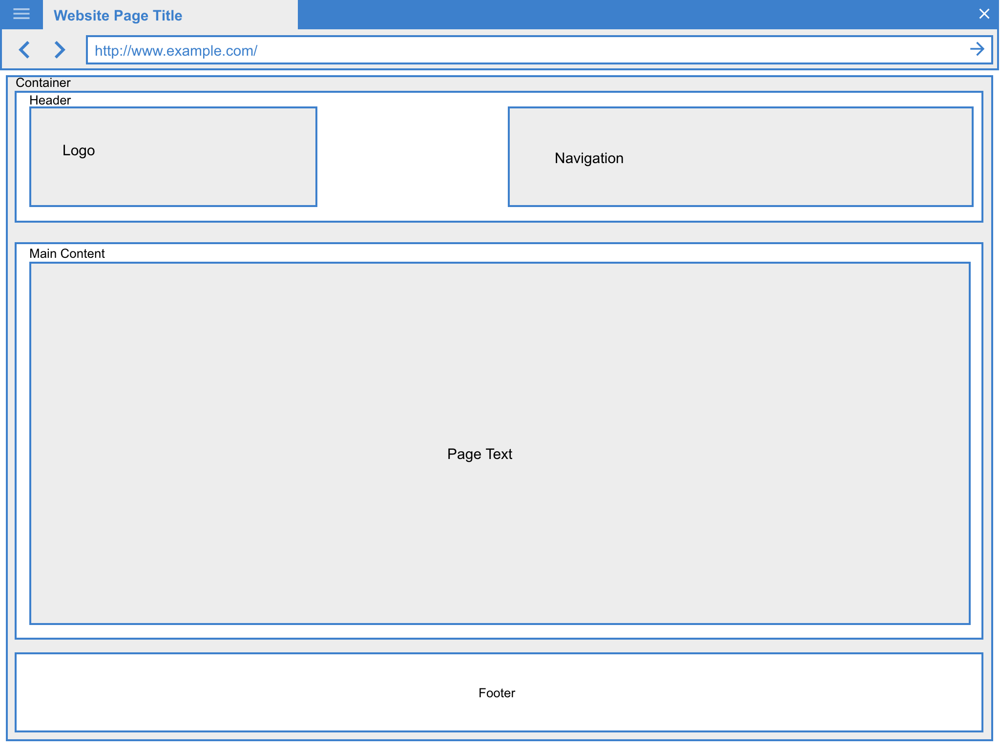

# Joe's Pizza project

## Structuring a Web Page

This project is a sandbox project for playing around with how to structure web page. We will create a page layout using a number of html5 elements (`<header>`, `<footer>`, and `<section>`)

We will start by planning the pages of the website  and then  creating  wireframes for the page layout.

### Creating Layout templates

This sandbox project is about building a website for a fictitious Pizza restaurant chains, Joe's Pizza.co. 

Joe Balochio (the owner) wants a brand new website to look stylish and incorporate some design aspects inspired by his italian root. He wants a menu and information about the locations of all the different restaurants he operate. Joe would also love to have a page for news items so he can let his customers know about all the great things that his company does.

#### Common logical structure

The sections that make up the visible layout of webpage follow this logical structure :

1. A header
2. Some navigation
3. Some page content
4. A footer

HTML5 include a series of new elements that we can use to define each section. Some of this elements have semantic meaning, which can help make our code easier to understand and help computer programs to identify the purpose of the content found within each element.

#### Planning the Sitemap

The first step to complete is to create the sitemap. Sitemap defines how many pages the website will have and what those page will be Starting from Joe's request, here is the sitemap for the website to be built.

1. Home
2. About
3. News
4. Menu
5. Locations
6. Sitemap

Most websites are based on a few different _templates_ that are used to create each page. This templates provide an empty shell that we can add content to in order to create new pages. Using templates enables us to keep all pages looking consistent throughout our website.

We will create two templates for our Joe's Pizza website: one for the _home page_ and one for the _content pages_. Content pages primarily contain text, so they need a slightly different layout from the home page.

#### Planning the Page Layouts

Before starting coding away, it's best to create a rough mock-up of how the pages will look like. Mock-up, often referred to as _wireframes_ uses boxes to indicate the position of key elements such us a navigation, content and logo.

All our web pages will have five common elements: header, logo, navigation, main content area, and a footer.

This wireframe shows the position of all the main page section: the header which contains the logo and navigation sections, the main content area; and the footer. The home page has three sections that comprise the page main content: the main feature to attract the viewer's attention, a text box for some initial information about the company, and a section to display special offers.

For the content page template, we use similar layout, changing the main content area by replacing the main content sections with a single area for the page text as shown bellow.

### Creating the template files

We need two template.

1. a home page template
2. content page template

#### Creating the home page template

